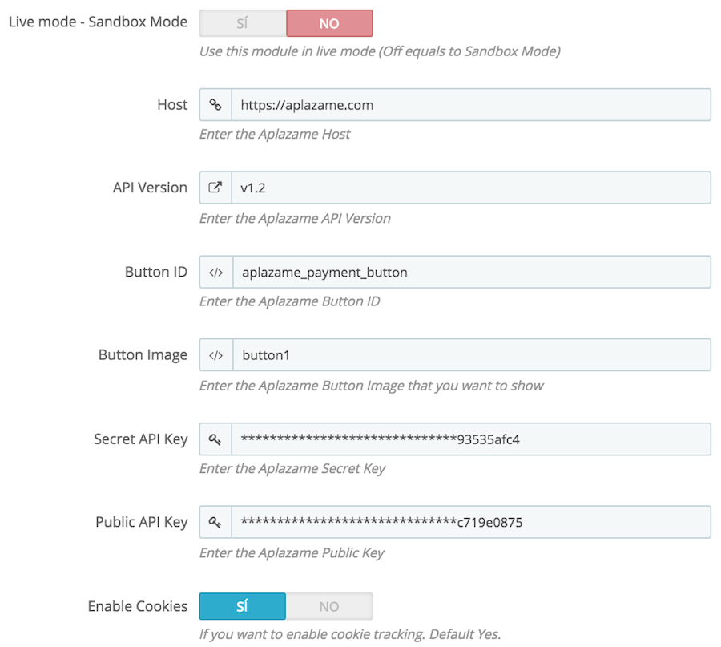

### Install

1. Download the latest stable [here](https://s3.eu-central-1.amazonaws.com/aplazame/modules/prestashop/latest.zip).
2. Go to the PrestaShop administration page, **Modules** > **Modules**.
3. **Add new module** using zip package.

### Configure 

- **Sandbox**: Determines if the module is on Sandbox mode.
- **Host**: Aplazame host **https://aplazame.com**
- **API Version**: The latest version is: **v1.2**
- **Button ID**: This value is the DOM id for your payment method on the cart. Is needed to hide if Aplazame is not ready to place a order in the system. The default value is **aplazame_payment_button**
- **Button Image**: With this you can change the image that appear as payment method on you cart. Available at this moment:
    - **button1**:  

- **Secret API Key**: Here is the Secret Key provided by Aplazame. You cannot share this key with anyone!!!
- **Public API Key**: Here is the Public Key provided by Aplazame. 
- **Enable Cookies**: If you want to enable cookie tracking for better interests. 

> NOTE: Be sure that on all fields you don't keep any whitespace. Otherwise the module can generate unexpected results.

#### Live demo

This is the online demo for uses to test Aplazame and its features. 

[http://prestashop.aplazame.com](http://prestashop.aplazame.com)

#### Install Prestashop

It is easy to deploy Prestashop with [Ansible](http://www.ansible.com/home)!

[https://github.com/aplazame/ansible-prestashop](https://github.com/aplazame/ansible-prestashop)

#### Release history

For new features check [this](HISTORY.md).

#### Help

**Have a question about Aplazame?**

For any support request please drop us an email at email soporte@aplazame.com.
